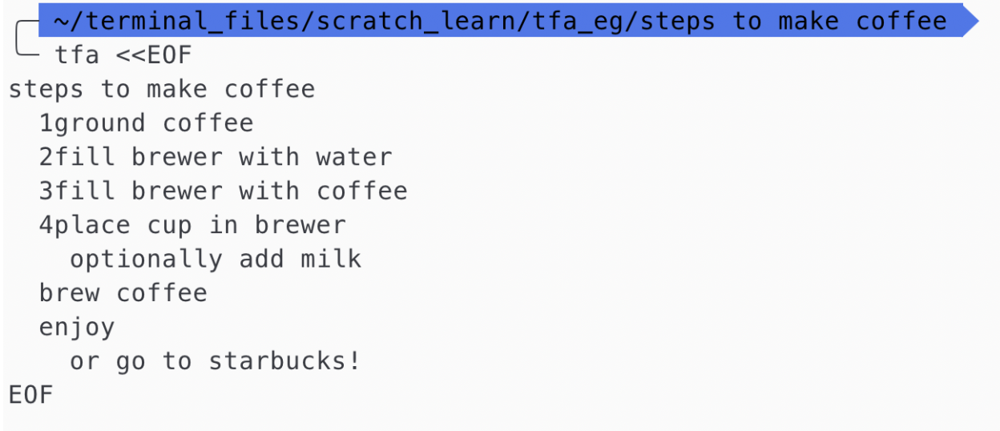
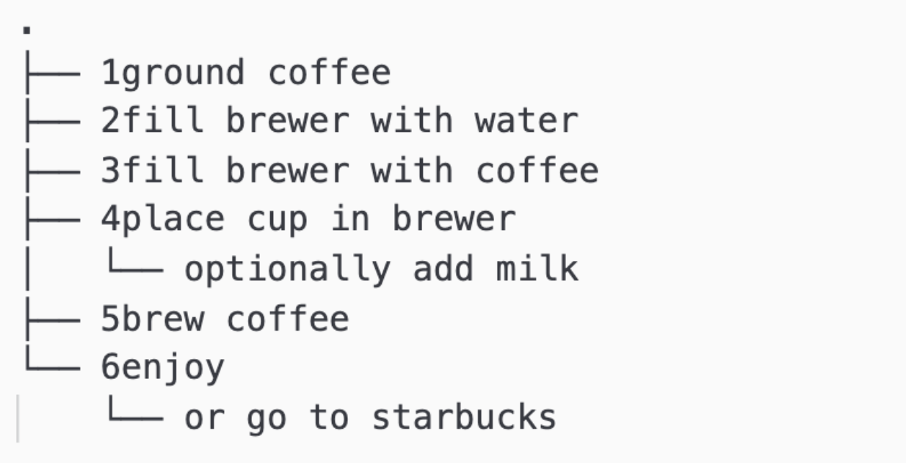

# Tree-For-All

## Overview
Tree-for-All(TFA) will be a python CLI application delivered as a binary. The objective is to get an indented text from the user in the form of CLI input or a text file and produce an output akin to the “tree” command output in *nix systems. This would help developers and programmers while documenting a workflow or representing a nested-flowing relationship in their documentation.

## Expected Behaviour

### Input


### Output


### Optional features
  - User should be able to input a text file as well and should be able to get the same result for eg. entering the following shoudl yield the same result
  ```
  tfa -i brew_coffe.txt
  ```
  - A  ``-h`` help flag to display a small wiki page about the usage of the command

### Roadmap features

  - A vertically flowing tree diagram as opposed horizontal branches